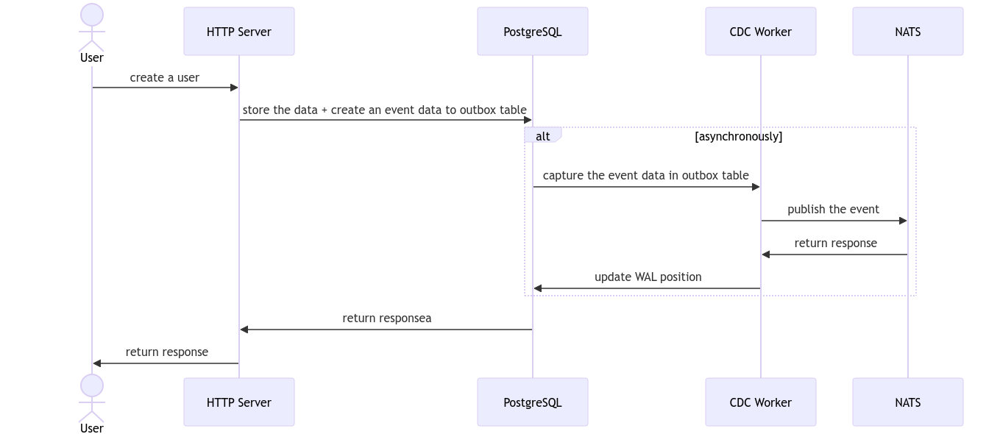

## Outbox Pattern
Outbox pattern is a software design pattern that is used to ensure reliable and scalable event-driven architectures. It involves the use of an "outbox" table or collection in a database to store events that need to be published to other services or systems. Instead of directly publishing events, the application writes them to the outbox, and a separate process or service reads the events from the outbox and publishes them asynchronously. This pattern helps decouple the publishing of events from the main application logic, improving performance and reliability.

## Change Data Capture (CDC)
Change Data Capture (CDC) is a technique used in software systems to capture and propagate changes made to a database in real-time. It involves monitoring the database for any modifications, such as inserts, updates, or deletes, and capturing the details of these changes. The captured data is then transformed into a format that can be easily consumed by other systems or services. CDC enables applications to react to data changes immediately, allowing for real-time data integration, synchronization, and analysis across different systems or components.

## Testing Locally

### Sequence Diagram

- Run the docker compose
    - `$ docker-compose up`
- Try to feed the data by running the request generator
    - `$ ./gen_request.sh`
- Monitor your application log on the terminal or through Docker dashboard.
- All the data will be stored along with the event data.
- The NATS subscriber consumed all the event data published by the CDC Worker.